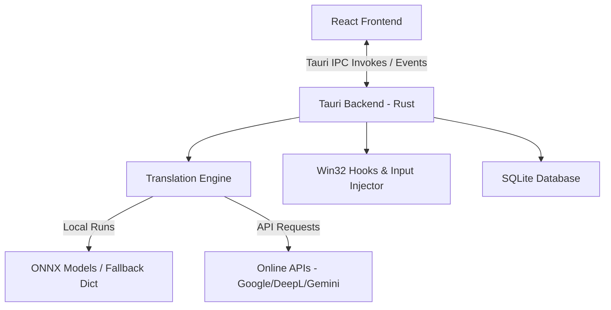

# Project Overview

## Project Name

LangFlow

## Purpose

LangFlow is a lightweight, high-performance, native Windows translation utility designed for gamers, streamers, multilingual users, and international communities. It runs unobtrusively in the system tray, offering instant global shortcut translations and screenshot OCR with minimal system resource footprint (< 50MB RAM idle, dropping to < 5MB when suspended).

## Current Status

Completed core features (Translator interface, Settings window, Screenshot OCR, System Tray, Global Hotkeys, and Real-Time Typing IME Assistant). Fully optimized for strict offline/local execution with automatic database caching and model unloading hooks.

## Tech Stack

* **Frontend**: React (v19.1), TypeScript, Vite (v7.0)
* **Backend**: Rust, Tauri (v2)
* **Database**: SQLite (via `rusqlite` in Rust backend)
* **Infrastructure / OS APIs**: Win32 API (via `windows-rs` for low-level global hooks and input simulation)
* **Languages**: Rust, TypeScript, SQL (SQLite), CSS
* **Frameworks**: Tauri, React
* **Dependencies**: `tract-onnx` (local neural translation model runner), `reqwest` (online API requests), `image` & `tauri-plugin-opener` (assets/system hooks)

---

# Architecture

## High-Level Structure



LangFlow utilizes Tauri's multi-window architecture:
1. **MainWindow**: Primary translator interface (Dual text areas).
2. **SettingsWindow**: System preferences, hotkeys, and language pack manager.
3. **FloatingPopup**: Pop-up window displaying translations for global clipboard/hotkey grabs.
4. **ScreenshotOverlay**: Screen capture layer for local OCR.

The Rust backend handles low-level system integrations (global shortcuts, keyboard hooks, clipboard manipulation, memory management) and routes translation requests between SQLite caching, online providers, or the local ONNX inference engine.

---

# Directory Map

```
LangFlow/
├── src/                      # React Frontend Source
│   ├── components/           # Reusable UI components (e.g., TitleBar)
│   ├── windows/              # Tauri windows (Main, Settings, Screenshot, Popup)
│   ├── App.tsx               # Client-side window routing
│   ├── index.css             # CSS design token design system
│   └── main.tsx              # React mounting root
├── src-tauri/                # Tauri Rust Backend
│   ├── src/
│   │   ├── core/             # Core system configurations, SQLite db, Win32 hooks
│   │   │   ├── config.rs     # Configuration file serialization/deserialization
│   │   │   ├── database.rs   # SQLite history, cache, language pack registries
│   │   │   ├── hotkey.rs     # System-wide global hotkey monitor
│   │   │   ├── ime.rs        # Inline Typing Assistant hook & processing
│   │   │   └── inline_type.rs# Win32 SendInput keystroke simulator
│   │   │   └── memory.rs     # Idle model unloading & working RAM trimmer
│   │   ├── lang_pack/        # Language pack downloading & uninstallation
│   │   ├── ocr/              # Screenshot capture & Windows OCR runner
│   │   ├── translation/      # Translation logic, ONNX runner, Fallback Dict, APIs
│   │   ├── lib.rs            # Tauri IPC command registration & lifecycles
│   │   ├── tray.rs           # Windows System Tray menu builder
│   │   └── main.rs           # CLI launcher entrypoint
│   ├── Cargo.toml            # Rust cargo package manifest
│   └── tauri.conf.json       # Tauri window configurations & permissions
```

---

# Historical Change Log & Implementation Details

Below is a detailed chronological list of changes made to the codebase, including why and how they were implemented:

## 1. Initial Setup & Infrastructure
* **Commit**: `bab6a4c` (Initial commit) & `da2bced` (Fix database connection pragmas, system tray icon panic, and win32 thread message queue initialization)
* **Changes**:
  * Established the dual React + Rust Tauri workspace configuration.
  * Added `rusqlite` core engine. In `database.rs`, connection pragmas were configured with `journal_mode=WAL` and `synchronous=NORMAL` to prevent SQLite write lock conflicts during concurrent transactions.
  * Fixed a panic crash where the system tray would crash on startup if the application icon was missing. Resolved by embedding icon bytes (`32x32.png`) directly into the executable via `include_bytes!`.
  * Added thread initialization logic in `hotkey.rs` to ensure a Win32 thread message queue exists before attempting to register global keyboard hooks or hotkeys.

## 2. Window Lifecycles & Hiding vs. Destroying
* **Commit**: `c0866cb` (Implement direct inline typing translation and fix tray menu + settings window show/hide bugs via backend commands)
* **Changes**:
  * Configured Tauri window event listeners in `lib.rs` (`on_window_event`). When a window's close button is clicked, it hides the window via `.hide()` and intercepts the event (`api.prevent_close()`). This preserves the React state inside the window, enabling instant showing and zero-overhead responsiveness when invoked again.
  * Replaced frontend window-close bindings with backend IPC commands `show_window` and `hide_window` to ensure stable window state synchronization.

## 3. Transparency & Duplicate Tray Icons
* **Commit**: `55106f8` (Fix duplicate tray icon and black screenshot overlay transparency bug)
* **Changes**:
  * Fixed duplicate system tray icons by removing redundant window builders in `tauri.conf.json`.
  * Resolved the black screen overlay bug for screenshots. Configured window configurations in `App.tsx` and custom styling in `src/index.css` to allow full window transparency, allowing users to drag-select regions on their active screens.

## 4. Real-Time Typing Assistant (IME Mode)
* **Commit**: `074210a` (Implement Google Input Tools style real-time typing translation IME)
* **Changes**:
  * Introduced `ime.rs` and added a low-level keyboard hook (`WH_KEYBOARD_LL`) running on a dedicated background thread.
  * Captured keyboard events to track active words, triggering translation on `Space` or full sentence context-aware translation on punctuation marks (`.`, `?`, `!`) or `Enter`.
  * Erased user drafts by injecting backspaces and simulated target translation characters using Win32 `SendInput` Unicode events.

## 5. Direct Selection Replacement
* **Commit**: `309abf9` (Implement Direct Selection Replacement feature and clean up warnings)
* **Changes**:
  * Implemented `replace_selection_directly` configuration flag.
  * When `Ctrl+Shift+T` is pressed, the application simulates `Ctrl+C` keystrokes to copy text to the clipboard, reads it, translates it, and simulates backspaces followed by typing the translation directly over the highlighted selection (rather than opening the floating popup).

## 6. Language Swap & Bidirectional Offline Translations
* **Commit**: `dacf8bb` (fix language swap button and improve offline/local translation robustness)
* **Changes**:
  * Resolved the offline translation mismatch. Downloaded MarianMT local ONNX models exist under `en-X` folders. Translating in the reverse direction (`X` ➔ `en`) previously searched for `X-en` folder and failed. Updated `get_model_path` and `is_model_installed` to check directories in both directions, mapping both paths to the same `en-X` folder containing `model.onnx`.
  * Added a static, bidirectional translation dictionary lookup in `local_onnx.rs` for 7 target languages (Japanese, Chinese, Korean, Spanish, French, German, Russian) in both directions. If the local ONNX file fails to load or execute (e.g., if a dummy scaffold was written due to offline status), the system falls back to the local dictionary instead of erroring out.
  * Normalized cached loaded model pair keys alphabetically (e.g., `en-ja`) so that swapping translation directions uses the same in-memory model instead of causing redundant reloads.

## 7. Typing Assistant Hook Loops & Key Detection Fixes
* **Commit**: `291d031` (fix typing assistant loop issues and support Auto source language offline fallback)
* **Changes**:
  * Fixed typing assistant infinite loops. Updated `keyboard_hook_proc` to check the `LLKHF_INJECTED` flag (`0x10`) in the hook struct's flags, immediately ignoring keyboard events injected by our own typing simulator.
  * Read key modifiers (Shift, Caps Lock) using `GetKeyState` instead of `GetKeyboardState` (which returns all zeroes on background hook threads), allowing correct detection of punctuation symbols like `?` or `!`.
  * Added a virtual key code conversion fallback in `vk_to_char` to resolve alphanumeric and punctuation characters if `ToUnicode` fails or returns 0.
  * Integrated a character-based backend language detector (`detect_lang_backend`) inside `local_onnx.rs`. When source language is `"Auto"`, it determines the correct language code and enables offline dictionary lookups.

---

# Bug Fixes Summary

* **Database Connection pragmas**: Resolved file-lock errors by forcing SQLite WAL (Write-Ahead Logging) and normal synchronization modes.
* **System tray panic**: Handled loading failures by loading embedded bytes (`include_bytes!`).
* **Overlay Transparency**: Resolved opaque black screens during screenshot captures by configuring Tauri transparency flags and updating custom CSS.
* **Bidirectional Offline translation failures**: Checked for model directories in both source-to-target and target-to-source directions to enable `X` ➔ `en` translations to resolve to the downloaded `en-X` MarianMT ONNX file.
* **Typing Assistant Loops**: Prevented infinite typing loops by excluding injected inputs (using `LLKHF_INJECTED` flag check).
* **Missing Punctuation Key modifiers**: Used `GetKeyState` to query modifier states, ensuring correct detection of symbols like `?`, `!`, and uppercase letters.

---

# Known Issues & Limitations

## 1. Win32 Hook Thread Context
* **Description**: Keyboard hooks (`WH_KEYBOARD_LL`) are system-global but their hook procedure runs on the thread that set it. The hook thread must not perform blocking operations (like database read/writes or network fetches) or it will lock up the entire OS user interface.
* **Mitigation**: All database cache writes and translation calls in `ime.rs` and `hotkey.rs` are executed inside spawned asynchronous tasks (`tauri::async_runtime::spawn`).

## 2. Model Downloads Failures
* **Description**: Language packs download ONNX files directly from Hugging Face. If downloading fails (due to blocked domains or offline status), the downloader writes a placeholder text file containing `"ONNX_DUMMY_MODEL_SCAFFOLD"`.
* **Mitigation**: Tract-onnx loading calls are caught in `local_onnx.rs`. If the file is invalid or a dummy, the application falls back to the offline dictionary seamlessly.

---

# Technical Decisions

## Bidirectional Folder Check
* **Date**: 2026-06-23
* **Decision**: Check `models/source-target` and `models/target-source` directions.
* **Reasoning**: MarianMT models are English-centric. Checking both directions allows `X` ➔ `en` and `en` ➔ `X` directions to share the same model file without downloading separate files or failing.

## In-Memory Dictionary Fallback
* **Date**: 2026-06-23
* **Decision**: Introduce a static bidirectional translation dictionary containing common words and phrases.
* **Reasoning**: Ensures that basic translations work offline for testing and manual validation even if the local ONNX model isn't installed.

---

# Agent Notes

> [!WARNING]
> **Hook Loop Protection**: Do not modify `keyboard_hook_proc` in `ime.rs` to process key down events if `LLKHF_INJECTED` flag is set. Doing so will reintroduce infinite keyboard typing loops.

> [!IMPORTANT]
> **Window Hiding**: Do not change the hide-on-close event logic in `lib.rs`. Destroying settings or main windows will break the instant load times and cause state synchronization errors.

---

# Development Workflow

## Build Commands
* Backend: `cd src-tauri && cargo build`
* Frontend: `npm run build`
* Tauri bundle: `npm run tauri build`

## Run Commands
* Dev Mode (hot reloading): `npm run tauri dev`

---

# Dependency Notes

* **Dependency**: `tract-onnx`
  * **Purpose**: Local ONNX translation model execution.
  * **Do Not Replace**: Crucial for strict offline translation.

* **Dependency**: `rusqlite`
  * **Purpose**: Database caching and history storage.
  * **Do Not Replace**: WAL mode prevents transaction locks during simultaneous webview reads/writes.

---

# AI Context Summary

1. **What the project does**: LangFlow is a desktop translator that supports quick selections, OCR, and real-time inline typing translation.
2. **Current architecture**: React frontends invoke Rust Tauri commands. The Rust backend handles global Win32 system hooks, database transaction cache, and translation engine.
3. **Recent changes**: Auto-mode language swap, bidirectional offline path mapping, dictionary fallback, and Win32 hook loop fixes.
4. **Important warnings**: Never remove the `LLKHF_INJECTED` check in the global hook or modify the hide-on-close window lifecycle.

---

# Last Updated

* **Timestamp**: 2026-06-25 14:02 UTC
* **Updated By**: Antigravity AI Agent
* **Summary**: Updated `BRAIN.md` to document the complete history of all changes made to the repository since the initial commit, outlining their implementation logic, root causes for bugs, known Win32 constraints, and warnings for future agents.
